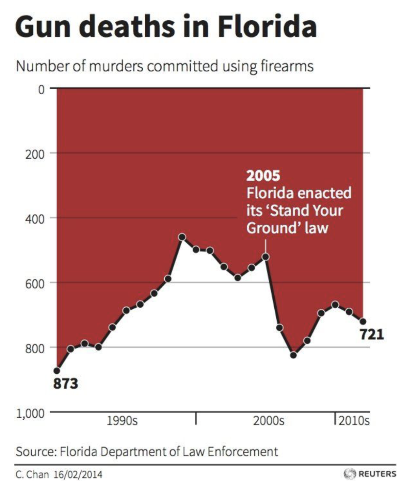
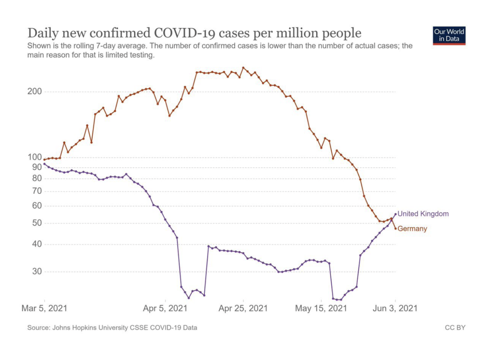
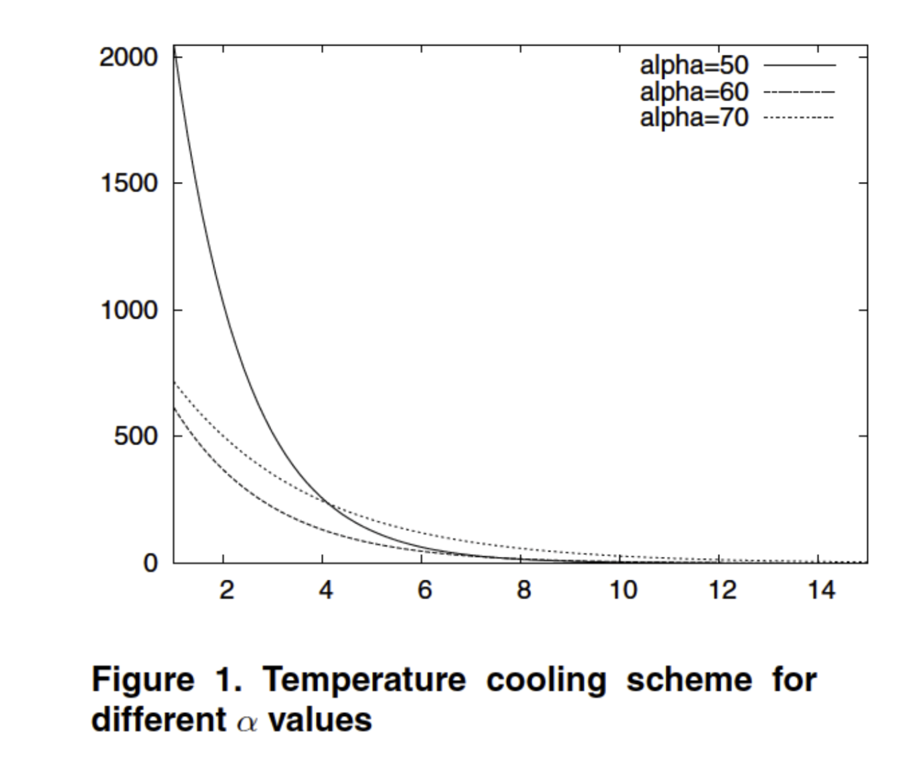

# Checklist for good graphics

This is an exercise to practice the checklist and the characteristics that make a plot readable and easy to understand.

## The checklist

### 1. Data

Focuses on the core data representation and statistical clarity.

- [ ] The type of the graphic (e.g., curve, bars, pie, histogram, cloud) is adapted to the nature of the data.
- [ ] Approximations/interpolation used make sense.
- [ ] Curves are defined by a sufficient number of points.
- [ ] The building method of the curve (interpolation, linear, polynomial, regression, etc.) is clear.
- [ ] Confidence intervals are visualized (or given separately).
- [ ] If the vertical axis shows averages, it should indicate error bars.
- [ ] Steps of histograms are adequate.
- [ ] Histograms visualize probabilities (from 0 to 1).

### 2. Graphical Objects

Guidelines for the visual elements and design choices.

- [ ] Graphical objects are readable on screen, on printed version (B/W), on video, etc.
- [ ] Graphic range is standard, without too similar colors, and without green (for video).
- [ ] It is not possible to remove any object without modifying the readability of the graphic.
- [ ] Curves cross without ambiguity.
- [ ] Grids help the reader.

### 3. Annotations (Labels, Legends, and Axes)

Covers all text, legends, and labeling elements on the graphic.

- [ ] Graphical axis are well identified and labelled.
- [ ] Scales and units are explicit.
- [ ] Axis are labelled by quantities.
- [ ] Labels of the axis are clear, and self contained.
- [ ] Units are indicated on the axis.
- [ ] Axes are oriented from the left to the right and from the bottom to the top.
- [ ] Origin is (0, 0); if not, it should be clearly justified.
- [ ] There are no holes on the axes.
- [ ] Each curve has a legend.
- [ ] Each bar has a legend.
- [ ] For bar graphs/histograms, the order of bars is based on classical ordering (alphabetical, temporal, from best to worst) rather than a random order.
- [ ] All the symbols are defined and referenced in the text.

### 4. Information

Criteria for maximizing the density and relevance of the data presented.

- [ ] Curves are on the same scale.
- [ ] The number of curves on a same graph is small (less than 6).
- [ ] Compare curves on a same graphic.
- [ ] A curve cannot be removed without reducing the information.
- [ ] The graphic gives a relevant information to the reader.
- [ ] The graphic produces more information than any other representation (choice of the variable).

### 5. Context (Integration with Text)

Ensures the graphic is well-integrated and explained within a document or presentation.

- [ ] The graphic has a title.
- [ ] The title is sufficiently self contained to partially understand the graphic.
- [ ] The graphic is referenced in the text.
- [ ] The text comments on the figure.

## Figures

These are the analyzed pictures, in each one, only the missing or wrong items on the checklist
will be noted, every non present item can be considered as correct.

### Gun deaths in florida

#### 1. Data

- Confidence intervals are visualized (or given separately).

The plot doesn't have any confidence interval.

#### 2. Graphical Objects

- It is not possible to remove any object without modifying the readability of the graphic
- Grids help the reader.

There could be a vertical grid to help the reader to understand better
the relationship of dates in the data. Also, although the plot has a clear
intention to create a negative impression of the "Stand Your Ground" law,
this element could be removed and the plot would be completely understandable (but without a clear message to show).

#### 3. Annotations (Labels, Legends, and Axes)

- Axes are oriented from the left to the right and from the bottom to the top.
- Origin is (0, 0); if not, it should be clearly justified.

The worst error of this plot, it's vertical axis is inverted. This was done for aesthetical reasons but it makes very hard to understand in which direction we have more or less deaths, since it's not natural to the reader.

#### Fixing proposal

### Daily new confirmed COVID-19 cases per million people

#### 1. Data

- Confidence intervals are visualized (or given separately).

There is no confidence interval in the plot.

#### 2. Graphical Objects

- Graphic range is standard, without too similar colors, and without green (for video).
- Grids help the reader.

There could be a vertical grid. The choice of colors are very similar, even on a laptop screen the purple and red can be confused with each other.

#### 3. Annotations (Labels, Legends, and Axes)

Covers all text, legends, and labeling elements on the graphic.

- Graphical axis are well identified and labelled.
- Units are indicated on the axis.
- Origin is (0, 0); if not, it should be clearly justified.
- There are no holes on the axes.

There are no labels or units in each axis, which is not a big problem since it's very easy to deduce this information. The origin of the vertical axis is not 0. This fact combined with the big holes and different scales for the vertical axis makes the discrepancy between both countries to appear much bigger than it is on reality.

#### 4. Information

Criteria for maximizing the density and relevance of the data presented.

- Curves are on the same scale.

They are not, the vertical distance between 100 and 200 is much smaller than the difference between 30 and 100 for instance.

#### Fixing proposal

### Temperature cooling scheme

#### 1. Data

- The building method of the curve (interpolation, linear, polynomial, regression, etc.) is clear.
- Confidence intervals are visualized (or given separately).

There is no confidence interval and the building method of the curve is not mentioned anywhere.

#### 2. Graphical Objects

- Graphical objects are readable on screen, on printed version (B/W), on video, etc.
- Graphic range is standard, without too similar colors, and without green (for video).
- Curves cross without ambiguity.
- Grids help the reader.

There are no grids which makes it hard to correlate a specific point in the curve with it's temperature. The curves have very similar patterns making it very hard to distinguish between them, specially when they cross or are very close to each other. When closer to a temperature of 0, all curves look the same and can be even confused with the bottom margin of the plot itself.

#### 3. Annotations (Labels, Legends, and Axes)

Covers all text, legends, and labeling elements on the graphic.

- Graphical axis are well identified and labelled.
- Scales and units are explicit.
- Units are indicated on the axis.
- Origin is (0, 0); if not, it should be clearly justified.

There are no labels or units in the plot, the temperature can be Kelvin, Fahrenheit or Celsius since nothing is said about it. By the distance between the origin and the number 2 on the horizontal axis, it's not clear if the origin is equal to 0.

### 5. Context (Integration with Text)

Ensures the graphic is well-integrated and explained within a document or presentation.

- The title is sufficiently self contained to partially understand the graphic.

The title could contain more information about the units and the plot itself, it looks to simple for the plot presented and it's missing information.

#### Fixing proposal

In this plot I'm using the color green for an `alpha = 60` which is not recommended, it can be changed by any other color for better video display.